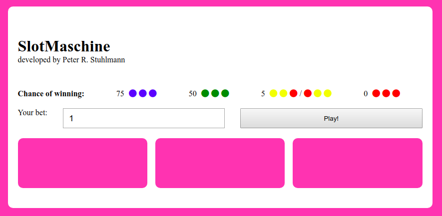
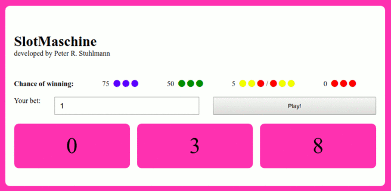
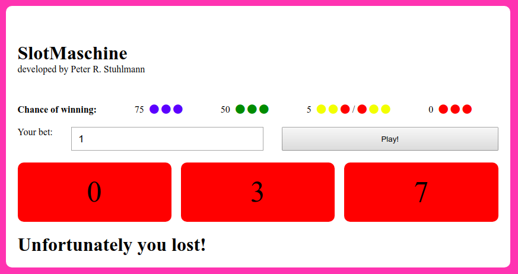
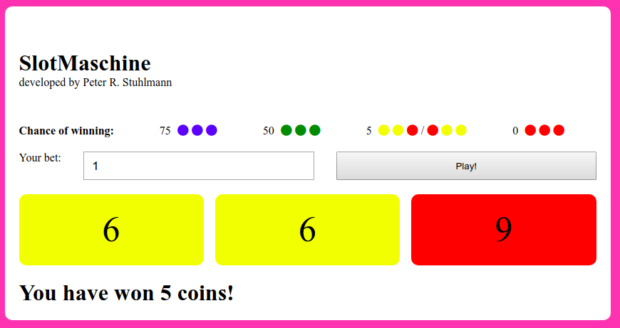
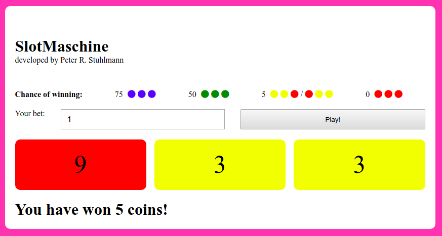

# Slot Maschine

    

## (1) blanco

## (2) Play!

## (3) "Unfortunately you lost!"

## or (3) "You have won 5 coins!"

## or (3) "Congrats! You have won 50 coins!"

## or maybe (3) "JACKPOT! You have won 750 coins!"

---

&copy; [Peter R. Stuhlmann](https://peter-stuhlmann-webentwicklung.de/ "Redirection to peter-stuhlmann-webentwicklung.de")